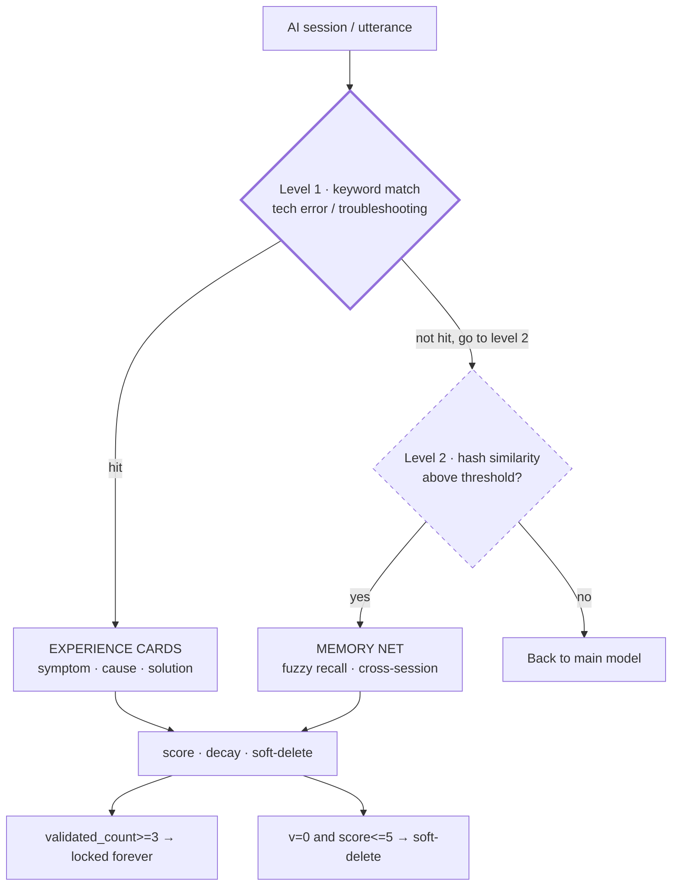
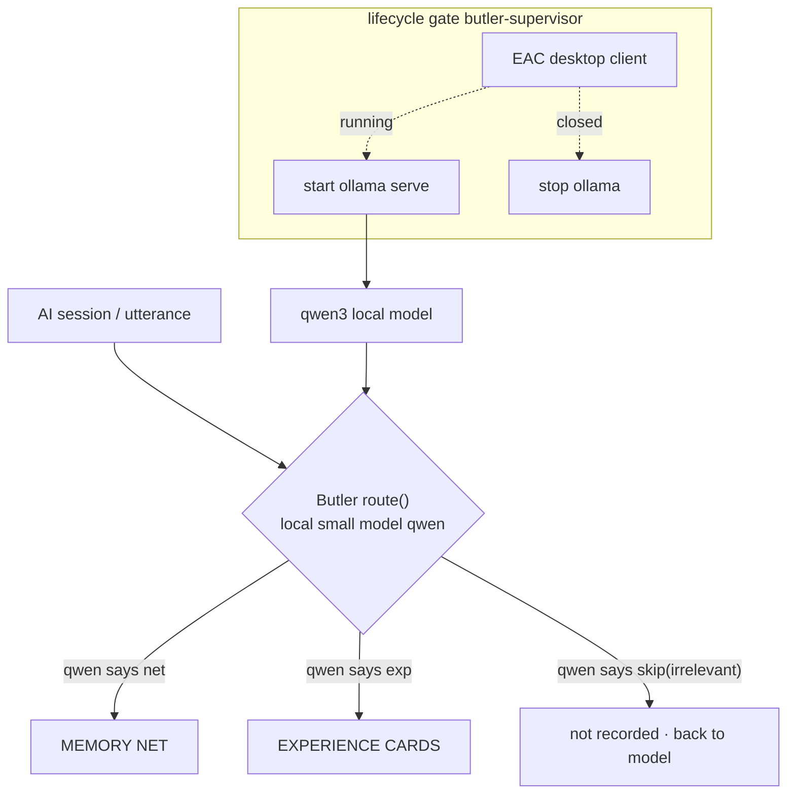
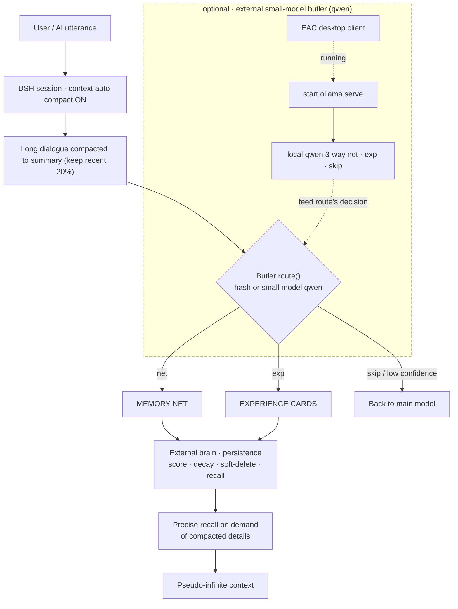

# DualTrack Memory — Dual-Track Memory

     [](https://github.com/aerwgwGERGAWER/dsh-dual-track-memory/actions/workflows/ci.yml)

**Current version: v1.3** (changelog: [RELEASE_NOTES.md](RELEASE_NOTES.md) & [MODIFICATION_RECORD.md](MODIFICATION_RECORD.md)).

An **open-source white-box memory system** for AI agents: fuzzy recall (memory net) + precise troubleshooting (experience cards) + score management + cross-session persistence. Zero extra-dependency and local by default; an AI can install it automatically.

> **About "memory"**: in this project's name, "memory" means **memory / knowledge base** — it has **nothing to do with hardware RAM**. It is the external brain that lets an AI persist and recall long-term knowledge.

> **Two abbreviations**: **DSH (DeepSeek Harness)** is the AI agent desktop client; this memory library runs as its plugin. **EAC (DeepSeek Harness EAC)** is that desktop client; "EAC desktop" below means it.

> **About "zero extra-dependency"**: the system **requires Node.js ≥ 18** to run; "zero extra-dependency" specifically means **no extra npm packages, models, or network** — it does NOT mean Node is unnecessary.

---

## Two architectures (side by side)

The memory "butler/router" decides whether a sentence goes to the **memory net** or the **experience cards**. Depending on whether you use an external local small model, there are **two architectures**, each with a diagram.

### Architecture A: default hash (`triage_brain: "hash"`) — zero extra-dependency · fully local
> No external model, no network. The butler computes similarity with a **deterministic hash vector**.

**Triage logic (two levels, NOT "hash similarity directly produces three classes")**:
- **Level 1**: first do a **keyword match** for "tech error / troubleshooting"; hit ⇒ bias toward the **experience cards**;
- **Level 2**: not hit ⇒ compute **hash similarity**; above threshold ⇒ **memory net**; below threshold ⇒ **back to the main model**.


> Legend: `v` = `validated_count`; `score` = score. **Hash similarity does NOT split into "memory net / experience cards / back"** — the "experience cards" branch is decided **first** by the **level-1 keyword** match, and only the remainder is decided by the **level-2 hash similarity** (memory net vs back to main model).

### Architecture B: external small-model butler (`triage_brain: "qwen"`, **optional**) — local small-model triage brain
> Runs a **local** small model (Ollama + Qwen3) on **your own machine**; the butler uses a three-way classification (`net` · `exp` · `skip`) — **more accurate semantics, more proactive triage**. It only starts the small model **while the EAC desktop client is running** (lifecycle gated); after the EAC desktop client closes it stops automatically, wasting nothing.



> **In one line**: Architecture A is fully local and costs nothing; Architecture B makes the butler's **semantic understanding more accurate and triage more proactive**, at the cost of a **local** small model (no DeepSeek API cost) that only runs while the EAC desktop client is up.

---

## Complete execution flow (context compression → pseudo-infinite context)


> The "long dialogue compacted to summary (keep recent 20%)" is DSH's **context auto-compact** — suggested threshold 75%, keep recent 20%.

---

## Context compression · pseudo-infinite context

This system is designed to work with DSH's **context auto-compact** mechanism.

First, distinguish two concepts:
- **Storage capacity**: theoretically **no upper limit** — you can store as much as the disk allows;
- **Context injection**: **but** the **memory navigation index** injected into the model window per conversation (default 120 entries / 4000 chars) **has a clear upper limit**.

When a long dialogue triggers auto-compaction (suggested threshold **75%**, keep the recent **20%**), historical details are condensed into summaries; meanwhile this system's "external brain" can **precisely recall on demand** and make a best effort to bring back compacted details.

Together they **go around** the model's physical window limit, achieving **pseudo-infinite context** — here "pseudo" means: **storage can be large, but what can be injected per conversation is bounded**, so it is only "greatly expanded vs the raw window", not mathematical infinity.

> **Note: it is "pseudo-infinite", not truly infinite.** Its **upper limit** is: every prompt injects a memory navigation index — when tags/entries are very numerous, that index itself **consumes the model's context window**, so the context remains bounded at extreme scale. To that end the engine already caps the navigation injection (default 120 entries / 4000 chars; **when exceeded it auto-truncates and prompts the user to use precise search**; tune via `dual_track.memory_network.nav_max_entries` / `nav_max_chars` in `memory.config.json`), and heavy memory should be managed with chunking, sharding, and archiving. In short: **storage has no hard limit, but per-conversation injection does — hence "pseudo-infinite".**

---

## Package contents (two release packages)

**Main package `dsh-dual-track-memory-v1.3.zip`** — clean core, 27 files, **contains no butler / daemon scripts** (e.g. `butler-supervisor.mjs`, `启动分诊脑.cmd`); only standard install entry points. Contents:
- **`src/`** core engine
  - `memory_dual.js` — dual-track engine (memory net + experience cards)
  - `memory_agent.js` — legacy single-track engine (kept for compatibility)
  - `plugin/` — DeepSeek Harness plugin (`index.js` / `tools.js` / `package.json` / `cordis.patch.yml`)
- **`docs/`** bilingual docs (`README` / `USER_MANUAL` / `AI_INSTALL` / `INSTALL_PORTABLE`)
- **`config/`** config templates (`memory.config.template.json`, `.env.example`)
- **Root files**: `scripts/install.mjs` one-click install · `install.cmd` double-click install · `RELEASE_NOTES.md` · `MODIFICATION_RECORD.md` · `UPLOAD_CHECKLIST.md` · `LICENSE` (MIT)

**Extension package `dsh-butler-extension-v1.3.zip`** — for those who want Architecture B (6 files, optional). Contents:
- `butler-supervisor.mjs` — lifecycle-gated daemon
- `启动分诊脑.cmd` — double-click to **start**; `停止分诊脑.cmd` — double-click to **stop** (**double-click the corresponding file for each action**)
- `ollama_triage.cjs` — small-model triage helper
- `triage.Modelfile` — triage model definition
- `BUTLER_INSTALL.md` — detailed guide

---

## Quick start

Prerequisite: **Node.js ≥ 18** (check with `node --version`).

```plaintext
:: Windows: double-click install.cmd   (or)  node scripts/install.mjs
:: Default hash mode works; self-check:
node src/memory_dual.js stats

:: For Architecture B (external small-model butler):
::   1) open <data-root>/memory.config.json, set dual_track.router.triage_brain to qwen
::      (data-root = the directory you chose at install; default is the repo root)
::   2) install Ollama and pull a model (see docs/BUTLER_INSTALL.md)
::   3) after saving, restart the DSH session
:: Verify triage (should return "brain":"qwen"):
node src/memory_dual.js route --text "test"
```

**Self-check success criteria**:
- `node src/memory_dual.js stats` should return JSON containing `"version": "1.3"`, `"network"`, `"experience"` — with no `error`;
- `node src/memory_dual.js route --text "xxx"` should return `"target"` (`net` / `exp` / `null`) and `"reason"`.

**Minimal working example (verify memory works after install)**:
1. After install (see "Quick start"), tell your AI assistant: `记住：这是测试记忆` ("remember: this is test memory");
2. **Restart the DSH session**;
3. Ask it: `刚才我让你记住了什么？` ("what did I ask you to remember?") — it should recall "this is test memory" from the memory net.

> This exercises the full "write → persist → cross-session recall" path and is the fastest way to confirm the memory library works.

**Docs**:
- [docs/README.md](docs/README.md) — human intro
- [docs/USER_MANUAL.md](docs/USER_MANUAL.md) — user manual
- [docs/AI_INSTALL.md](docs/AI_INSTALL.md) — AI auto-install & troubleshooting
- [docs/INSTALL_PORTABLE.md](docs/INSTALL_PORTABLE.md) — portable edition

> Note: this project is released for our own development needs; the author has limited time and provides **no human tech support/install guidance**. Use your own AI assistant for any issue.

---

## FAQ

**Q1: How to roll back if `bge` fails?**
Set `dual_track.router.embedding_provider` back to `"hash"` in `memory.config.json` (or remove that field), save, then restart the DSH session to revert to the default hash vector. **Rolling back does not corrupt stored data** (hash/vector fields are independent; the engine backfills missing/invalid vectors). If it still misbehaves, `install.mjs --rebuild-embeddings` can re-embed with a backup (see [MODIFICATION_RECORD.md](MODIFICATION_RECORD.md)).

**Q2: Experience-card validation not passing?**
If `exp-add` shows "high-risk / pending approval", that is **normal protection** (a high-risk keyword triggered). After confirming the environment, run `node src/memory_dual.js exp-validate --id EXP-xxxx` to mark it validated; once `validated_count` reaches 3 the entry is locked forever. If it's a false positive, check the risk keywords in [AI_INSTALL.md](docs/AI_INSTALL.md) or remove the word from `risk_keywords_high`.

**Q3: Seeing "current is hash mode, no need to start"?**
That means `triage_brain` is still `hash`. Open `<data-root>/memory.config.json`, set `dual_track.router.triage_brain` to `qwen`, save, restart the session, then double-click `启动分诊脑.cmd`.

---

## Appendix: Glossary

| Term | Full name / meaning |
|---|---|
| **DSH** | DeepSeek Harness (AI agent desktop client; this memory library runs as its plugin) |
| **EAC** | DeepSeek Harness EAC desktop client (the lifecycle-gate baseline for the small-model butler) |
| **Memory net** | memory net (stored in `memory_network.json`): fuzzy recall, cross-session persistence; one of the two tracks |
| **Experience cards** | experience cards (dir `experience_cards/`): technical troubleshooting case (symptom / cause / solution); one of the two tracks |
| **Dual-track** | memory net (fuzzy) + experience cards (precise), two independent tracks |
| **Soft delete** | only mark an item `garbage`, never physically delete, traceable |
| **Context compression** | DSH compacts a long dialogue into a summary, keeping the recent 20% (suggested threshold 75%); with the memory library it forms "pseudo-infinite context" |
| **v** | abbreviation for `validated_count`; `score<=5 and v=0` means "low score and never validated" |

## License
MIT License (see [LICENSE](LICENSE)).
