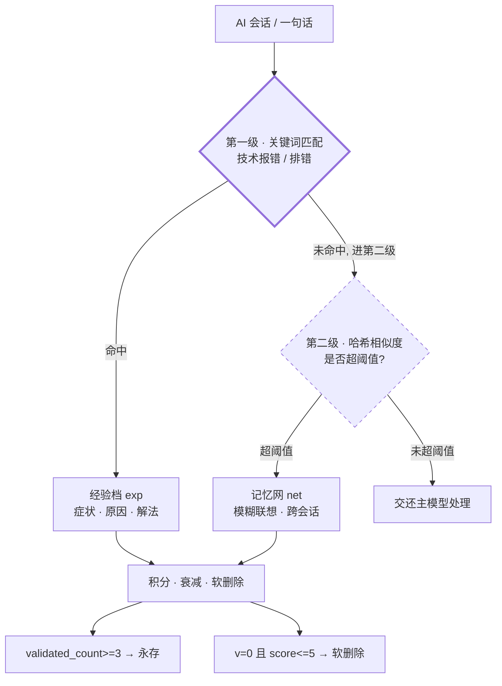
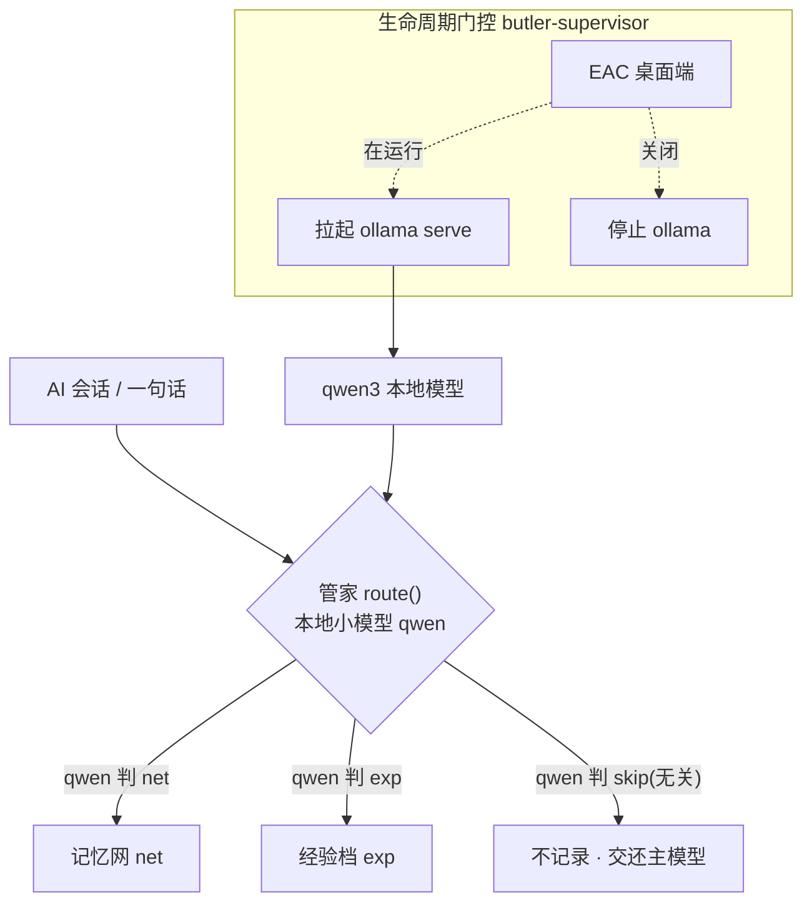
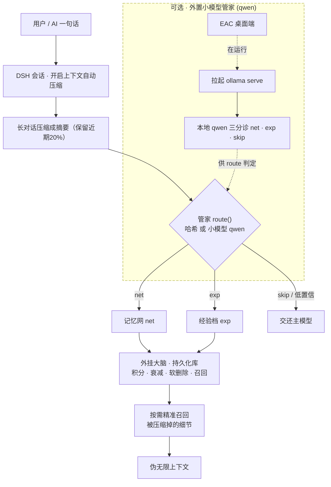

# DualTrack Memory — 双轨记忆库

     [](https://github.com/aerwgwGERGAWER/dsh-dual-track-memory/actions/workflows/ci.yml)

**当前版本：v1.3**（变更记录见 [RELEASE_NOTES.md](RELEASE_NOTES.md) 与 [MODIFICATION_RECORD.md](MODIFICATION_RECORD.md)）。

一个用于 AI Agent 的**开源白盒记忆系统**：模糊联想（记忆网）+ 精准排错（经验档）+ 积分制管理 + 跨会话持久。默认零额外依赖、纯本地，AI 可自动安装。

> **关于「memory」**：本项目名中的 "memory" 指「**记忆 / 知识库**」，**与计算机硬件『内存（RAM）』无关**——它是让 AI 持久记住并检索长期知识的外挂大脑。

> **两个缩写**：**DSH（DeepSeek Harness）** 是 AI 智能体桌面客户端，本记忆库作为它的插件运行；**EAC（DeepSeek Harness EAC）** 是该桌面客户端，下文「EAC 桌面端」即指它。

> **关于「零额外依赖」**：本系统**基础运行需要 Node.js ≥ 18**；「零额外依赖」特指**无需额外安装 npm 包、模型或联网**——并非连 Node 运行环境都不需要。

---

## 两种架构对照

记忆库的「管家分诊」负责判断一句话该进「记忆网」还是「经验档」。按是否需要外置本地小模型，分**两种架构**，各配一张图。

### 架构 A：默认哈希（`triage_brain: "hash"`）— 零额外依赖 · 纯本地
> 无需外部模型、不联网。管家用**确定性哈希向量**算相似度。

**分诊逻辑（两级递进，不是"哈希相似度直接分出三类"）**：
- **第一级**：先做「技术报错 / 排错」**关键词匹配**，命中 ⇒ 偏向进入**经验档**；
- **第二级**：未命中 ⇒ 再计算**哈希相似度**，超阈值 ⇒ 进入**记忆网**；未超阈值 ⇒ **交还主模型**。


> 图注：`v` = `validated_count`（已验证次数）；`score` = 积分。**哈希相似度不会自动分出「记忆网 / 经验档 / 交还」三类**——「经验档」由**第一级关键词**先行判定，剩余再由**第二级哈希相似度**决定进「记忆网」还是「交还主模型」。

### 架构 B：外置小模型管家（`triage_brain: "qwen"`，**可选**）— 本地小模型分诊脑
> 在**你自己电脑**跑一个本地小模型（Ollama + Qwen3），让管家用**小模型三分诊**（`net` · `exp` · `skip`）判定，**语义理解更准确、分诊更主动**；且**只在 EAC 桌面端运行时才拉起小模型**（生命周期门控），关闭 EAC 桌面端后自动停止，不浪费资源。



> **一句话区别**：架构 A 完全本地零成本；架构 B 让管家**语义理解更准确、分诊更主动**，代价是**本地**装一个小模型（不花 DeepSeek API 的钱），且只在 EAC 桌面端运行时才启用。

---

## 完整执行图（上下文压缩 → 伪无限上下文）


> 图中的「长对话压缩成摘要（保留近期20%）」即 DSH 的**上下文自动压缩**，建议阈值 75%、保留近期 20%。

---

## 上下文压缩 · 伪无限上下文

本系统专为配合 DSH 的**上下文自动压缩**机制设计。

需要先区分两个概念：
- **存储容量**：理论上**无上限**——磁盘允许就能存很多；
- **上下文注入**：**但**每次对话向模型窗口注入的**记忆导航索引**（默认 120 条 / 4000 字符）**有明确上限**。

当长对话触发自动压缩时（建议阈值设为 **75%**，保留近期 **20%**），历史细节会被浓缩为摘要；而本系统的「外挂大脑」能**按需精准检索**，尽量召回被压缩掉的重要细节。

两者的结合，可**突破**大模型物理窗口的限制，实现「**伪无限上下文**」——这里的"伪"正是指：**存储可以多，但每次能注入的上下文有上限**，因此只是"相对原始窗口大幅扩展"，而非数学上的无穷。

> **注意：它是「伪无限」，不是真正意义上的无限。** 其**理论上限**在于：每次提示词都会注入一份记忆导航索引——当标签/条目极多时，这份导航本身就会**挤占模型上下文窗口**，规模过大时上下文仍会受限。为此，引擎在导航注入处已加**条数/字符上限**（默认 120 条 / 4000 字符；**超出后系统自动截断，并提示用户使用精确检索**；可在 `memory.config.json` 的 `dual_track.memory_network.nav_max_entries` / `nav_max_chars` 字段中调整），并建议对海量记忆配合使用分词、分片、归档等方式管理。总之：**存储无硬上限，但每次注入有上限，故为「伪无限」。**

---

## 包内容（两个发布包）

**主包 `dsh-dual-track-memory-v1.3.zip`** — 干净核心，27 个文件，**不含任何管家 / 守护脚本**（如 `butler-supervisor.mjs`、`启动分诊脑.cmd` 等），仅含标准安装入口。文件清单：
- **`src/`** 核心引擎
  - `memory_dual.js` — 双轨引擎（记忆网 + 经验档）
  - `memory_agent.js` — 旧单轨引擎（兼容保留）
  - `plugin/` — DeepSeek Harness 插件（`index.js` / `tools.js` / `package.json` / `cordis.patch.yml`）
- **`docs/`** 中英双语文档（`README` / `USER_MANUAL` / `AI_INSTALL` / `INSTALL_PORTABLE`）
- **`config/`** 配置模板（`memory.config.template.json`、`.env.example`）
- **根文件**：`scripts/install.mjs` 一键安装 · `install.cmd` 双击安装 · `RELEASE_NOTES.md` · `MODIFICATION_RECORD.md` · `UPLOAD_CHECKLIST.md` · `LICENSE`（MIT）

**扩展包 `dsh-butler-extension-v1.3.zip`** — 给想用「架构 B」的人（6 文件，可选）。文件清单：
- `butler-supervisor.mjs` — 生命周期门控守护
- `启动分诊脑.cmd` — 双击**启动**守护；`停止分诊脑.cmd` — 双击**停止**守护（**分别双击对应文件**）
- `ollama_triage.cjs` — 小模型分诊助手
- `triage.Modelfile` — 分诊模型定义
- `BUTLER_INSTALL.md` — 详版说明

---

## 快速开始

前置：**Node.js ≥ 18**（`node --version` 确认）。

```plaintext
:: Windows: 双击 install.cmd   (或)  node scripts/install.mjs
:: 默认 hash 模式即可运行; 自检:
node src/memory_dual.js stats

:: 想用架构B(外置小模型管家):
::   1) 打开 <数据根>/memory.config.json, 把 dual_track.router.triage_brain 改为 qwen
::      (数据根 = 你安装时指定的目录; 默认在仓库根)
::   2) 安装 Ollama 并拉取模型(见 docs/BUTLER_INSTALL.md)
::   3) 保存配置后, 重启 DSH 会话生效
:: 验证分诊(应返回 "brain":"qwen"):
node src/memory_dual.js route --text "测试"
```

**自检成功标准**：
- `node src/memory_dual.js stats` 应返回一段 JSON，包含 `"version": "1.3"`、`"network"`、`"experience"` 等字段，且**无 `error`**；
- `node src/memory_dual.js route --text "xxx"` 应返回 `"target"`（`net` / `exp` / `null`）与 `"reason"`。

**最小上手示例（安装后验证记忆生效）**：
1. 安装完成后（见「快速开始」），对你的 AI 助手说一句：`记住：这是测试记忆`；
2. **重启 DSH 会话**；
3. 问它：`刚才我让你记住了什么？`——它应能从记忆网召回「这是测试记忆」。

> 这一句能打通「写入 → 持久化 → 跨会话召回」全链路，是确认记忆库可用的最快方法。

**文档**：
- [docs/README.md](docs/README.md) — 人类版入门
- [docs/USER_MANUAL.md](docs/USER_MANUAL.md) — 使用说明
- [docs/AI_INSTALL.md](docs/AI_INSTALL.md) — 给 AI 的自动安装与排错手册
- [docs/INSTALL_PORTABLE.md](docs/INSTALL_PORTABLE.md) — 便携版

> 说明：本项目为满足个人开发需求发布，作者精力有限，**不提供人工技术支持与安装指导**；遇到问题请用你自己的 AI 助手解决。

---

## 常见问题

**Q1：切 `bge` 失败怎么回退？**
将 `memory.config.json` 中 `dual_track.router.embedding_provider` 改回 `"hash"`（或直接删除该字段），保存后重启 DSH 会话即可回退默认哈希向量。**回退不会损坏已存数据**（哈希/向量字段彼此独立，引擎对缺失/异常向量可回退）；如仍异常，`install.mjs` 的 `--rebuild-embeddings` 可在备份后重嵌（见 [MODIFICATION_RECORD.md](MODIFICATION_RECORD.md)）。

**Q2：验证经验档不通过？**
`exp-add` 若提示「高风险 / 待审批」，是**正常防护**（触发高风险关键词）。确认环境无误后，用 `node src/memory_dual.js exp-validate --id EXP-xxxx` 标记验证；`validated_count` 达 3 后该条目永存。若误判，可先查 [AI_INSTALL.md](docs/AI_INSTALL.md) 的风险关键词配置，或把该词从 `risk_keywords_high` 移除。

**Q3：双击「当前为哈希模式，无需启动」？**
说明 `triage_brain` 仍是 `hash`。请打开 `<数据根>/memory.config.json`，把 `dual_track.router.triage_brain` 改为 `qwen`，保存后重启会话，再双击 `启动分诊脑.cmd`。

---

## 附录：术语速览

| 缩写 / 词 | 全称 / 含义 |
|---|---|
| **DSH** | DeepSeek Harness（AI 智能体桌面客户端，本记忆库作为其插件运行） |
| **EAC** | DeepSeek Harness EAC 桌面客户端（小模型管家的生命周期门控判断基准） |
| **记忆网** | memory net（存储文件 `memory_network.json`）：模糊联想、跨会话持久；双轨之一 |
| **经验档** | experience cards（目录 `experience_cards/`）：技术排错条目（症状 / 原因 / 解法）；双轨之一 |
| **双轨制** | 记忆网（模糊）+ 经验档（精准）两条相互独立的轨道 |
| **软删除** | 只把条目标记为 `garbage`，不物理删除、可追溯 |
| **上下文压缩** | DSH 把长对话压成摘要、仅保留近期 20%（建议阈值 75%），配合记忆库形成「伪无限上下文」 |
| **v** | `validated_count`（已验证次数）的缩写；`score<=5 且 v=0` 即「低分且从未验证」 |

## 许可
MIT License（见 [LICENSE](LICENSE)）。
